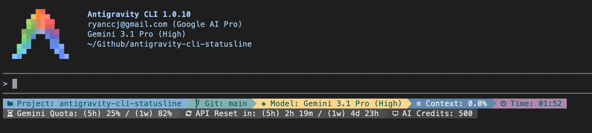

# Antigravity CLI Statusline Skill

[](skills/antigravity-cli-statusline.md)
[](LICENSE)
[]()

[繁體中文](README.zh-TW.md) | English

A multilingual, cross-platform skill that customizes the Antigravity CLI statusline (footer) — pick exactly which indicators to show, in any order you like, with smart line wrapping out of the box.

## What's New

- **New Indicators**: Added `5h/1w quota`, `5h/1w reset time`, and `AI credits`.
- **New Style**: Introduced the `colorful` style! Inspired by [Nanako0129/coralline](https://github.com/Nanako0129/coralline), bringing a highly elegant, ocean-themed gradient visual experience.


## Screenshots

### Windows

| English (us) | Traditional Chinese (zh-tw) | Japanese (jp) |
| :---: | :---: | :---: |
|  |  |  |

### macOS

| English (us) | Traditional Chinese (zh-tw) | Japanese (jp) |
| :---: | :---: | :---: |
|  |  |  |

## Installation

### Prerequisites

- **Node.js** (required) — the renderer scripts are pure `.mjs`. Without Node.js the statusline stays blank and `agy` will auto-disable it after repeated failures. The skill pre-checks this for you.
- **Git** (optional) — needed for `git-branch`, `vcs-dirty`, and `vcs-type` indicators.

### Step A — Install the plugin

```bash
agy plugin install https://github.com/ryanccj/antigravity-cli-statusline
```

> The CLI stages the bundle at `~/.gemini/antigravity-cli/plugins/antigravity-cli-statusline/`.

### Step B — Trigger the skill to finish setup

In the Antigravity CLI prompt, type:

```text
/antigravity-cli-statusline
```

The skill walks you through language selection, indicator picking, and sorting, then deploys the renderer scripts and writes the three-layer `settings.json`. The statusline updates **live without a CLI restart**.

## Indicators, Sorting & Line Wrapping

### Available Indicators

**AI Model & Agent**
- **Current AI model name (`model-name`)** — the model serving the current conversation
- **Active agent profile (`agent-profile`)** — the loaded Agent Profile name
- **Agent state (`agent-state`)** — `idle / thinking / working / tool_use / initializing`
- **AI credits (`ai-credits`)** — remaining account AI credits

**Quota & Tokens**
- **Account API available quota (`quota`)** — percentage, color-coded across four tiers
- **API reset countdown (`quota-reset-countdown`)** — time remaining until quota refreshes
- **Context window usage (`context-used`)** — percentage of context consumed
- **Session token count (`token-count`)** — precise token usage this session
- **Cumulative AI artifacts (`artifacts`)** — files/outputs produced this session
- **Account plan tier (`plan-tier`)** — current subscription level

**Interactive State**
- **Pending tool confirmation (`tool-confirmation`)** — a tool dialog is waiting on you
- **Pending user input queue (`pending-input`)** — queued inputs waiting to run
- **Running background tasks (`background-tasks`)** — active background task count
- **Active subagents (`subagents`)** — running subagent count

**Project & VCS**
- **Project short path (`project-path`)** — current workspace basename
- **Project full path (`project-full-path`)** — absolute workspace path
- **VCS type (`vcs-type`)** — `git / jj / fig`
- **Current Git branch (`git-branch`)**
- **Working tree status (`vcs-dirty`)** — `dirty / clean`

**System & Account**
- **System time (`system-time`)** — current local time
- **CLI RAM usage (`memory-usage`)** — RSS memory consumed by the `agy` process
- **Antigravity CLI version (`cli-version`)**
- **Conversation ID (`conversation-id`)** — first 8 chars, for debugging
- **Sandbox mode (`sandbox-status`)** — `off / on (net) / on (no-net)`
- **Account email (`account-email`)**

### Sorting

In the skill's third stage (Step 4), enter a comma-separated list of numbers in the Write-in box to set the order:

```text
2,5,1
```

- Numbers refer to the position in your Step 3 selection (1-based)
- Identifiers like `quota` or `model-name` also work and can be mixed in, but numbers are the most direct
- **Indicators you don't list are dropped** — the result is your final display set
- Leave it blank or pick `(Recommended) Skip` to keep the original selection order with all indicators shown

### Line Wrapping

Two mechanisms work together:

1. **Smart automatic wrapping** — the renderer reads the terminal width and wraps the next indicator to a new line when it would overflow. No setup required.
2. **Manual newline** — insert the `n` token in your sort string to force a line break at that position. Reusable:

```text
1,2,n,3,4
```

(If you picked 4 indicators in Step 3, this puts items 1–2 on line one and forces 3–4 onto line two.)

### Dynamic Colors

A 24-bit truecolor four-tier palette (Blue → Green → Yellow → Pink) shifts with API quota and context usage; each AI model family also gets its own brand accent color.

## Contributing

Contributions are welcome — including new indicators, cross-platform fixes, and AI-assisted language translations. See **[CONTRIBUTING.md](CONTRIBUTING.md)** for the workflow.

## Acknowledgements

This project is a fork and major enhancement of **[AndyAWD/antigravity-cli-statusline](https://github.com/AndyAWD/antigravity-cli-statusline)**, which provided the excellent cross-platform Node.js foundation.

Special thanks to **[60ke/antigravity-statusline](https://github.com/60ke/antigravity-statusline)** for the original inspiration behind the quota monitoring feature that paved the way for statusline integrations in Antigravity.

## License

This project is licensed under the [MIT License](LICENSE).
