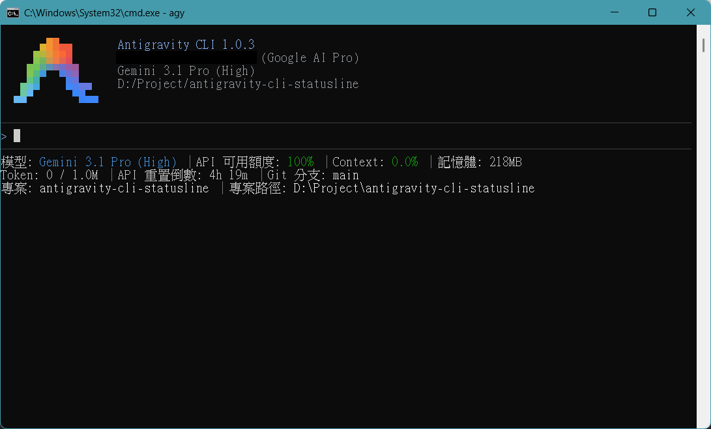
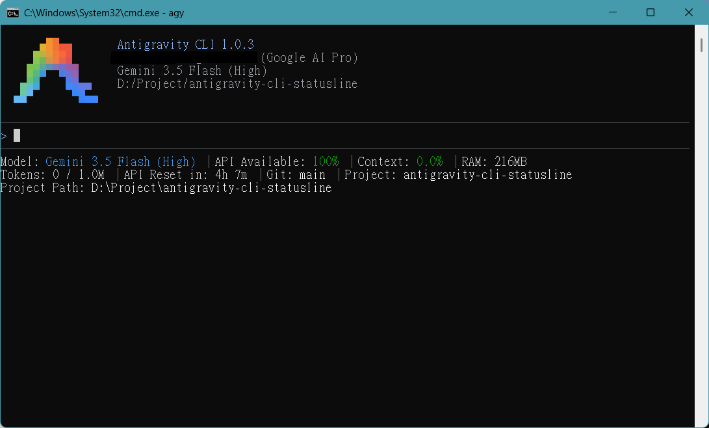
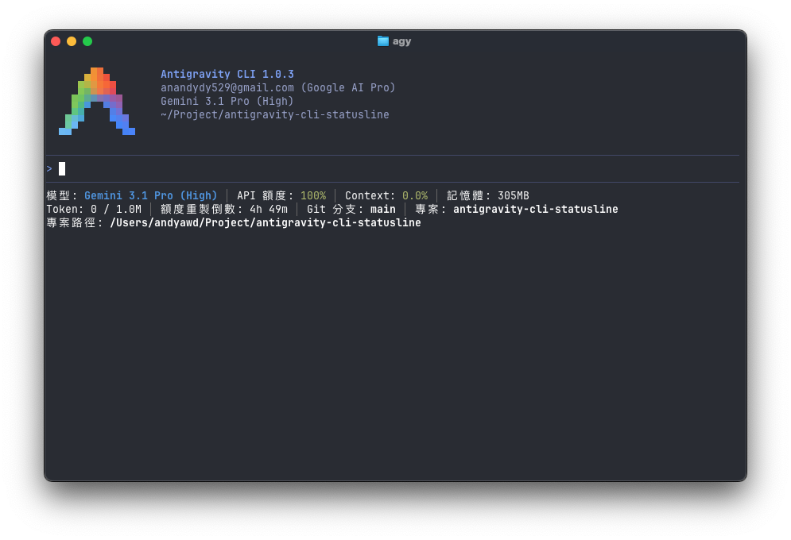
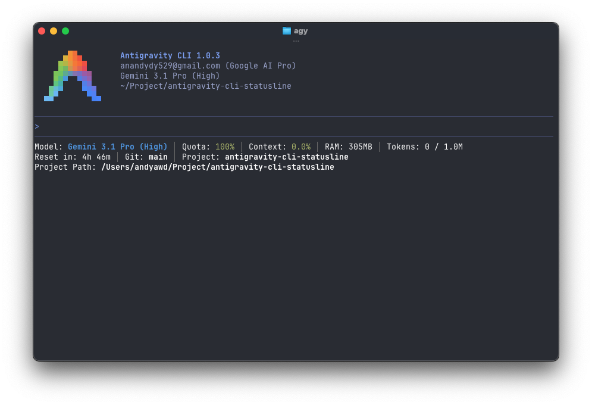
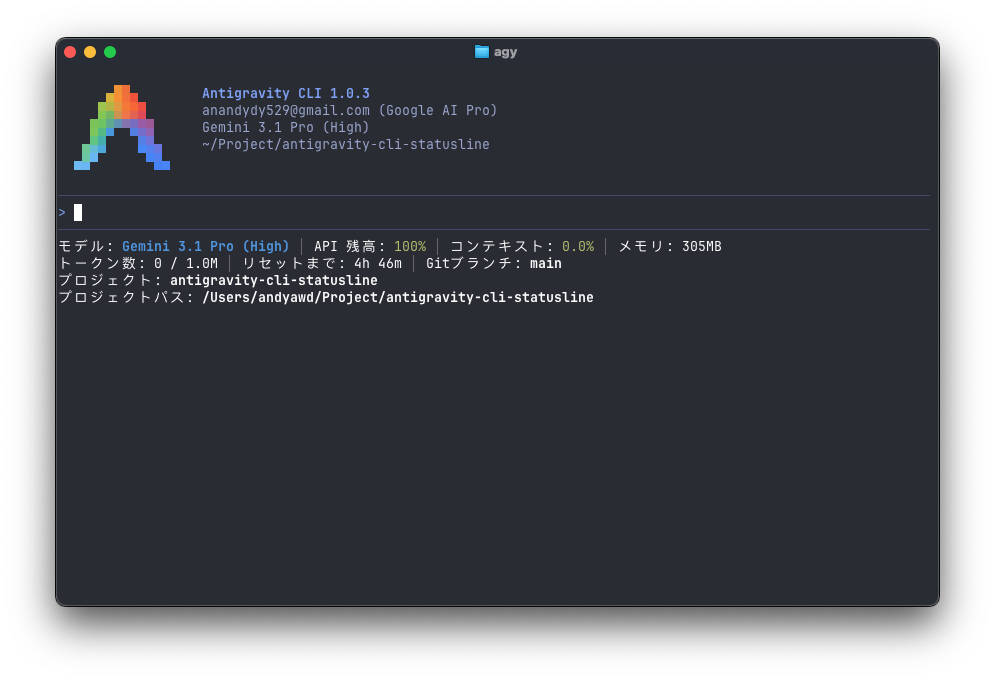

# Antigravity CLI 狀態列設定技能

[](./SKILL.md)
[](./LICENSE)
[]()

繁體中文 | [English](README.md)

本專案提供 Antigravity CLI 狀態列（Statusline / Footer）的客製化與語系設定技能，適用於多平台並確保在各種環境下都能維持高效與穩定的顯示。

## 實際畫面 (Screenshot)

### Windows

| 繁體中文 (zh-tw) | English (us) | 日本語 (jp) |
| :---: | :---: | :---: |
|  |  |  |

### macOS

| 繁體中文 (zh-tw) | English (us) | 日本語 (jp) |
| :---: | :---: | :---: |
|  |  |  |

## 功能特色

- **豐富的狀態列指標**：可自由選擇顯示以下資訊：
  - 目前使用的 AI 模型名稱
  - 帳號真實 API 可用額度 (Quota)
  - API 重置時間倒數
  - 目前對話已消耗的 Context 比例
  - 目前 Session 消耗的精確 Token 數量
  - CLI 行程所消耗的 RAM 記憶體量
  - 目前工作區專案的 Git 分支
  - 目前工作區專案路徑 (短路徑 / 完整路徑)
  - 帳號等級 (Account Plan Tier)
  - 帳號信箱 (Account Email)
  - AI 點數 (AI Credits)
- **自訂顯示排序與篩選**：透過互動式多階段問卷，自由選擇想要顯示的指標，並能手動決定它們的精確排列順序。
- **熱更新 (Hot-Reload) 支援**：設定完成後，狀態列將立即套用最新設定，無需重新啟動 CLI。
- **多國語言支援**：內建繁體中文、英文與日文，並提供讓 AI 一鍵擴充其他語系的動態架構，任何人都能輕鬆新增專屬的語言版本。
- **Node.js 環境預檢**：在寫入任何設定檔之前，技能會主動偵測 Node.js 是否已安裝。若缺失，會用使用者所選語系（zh-tw / us / jp）發出明確警告——避免 `agy` 反覆記錄 `statusline: command failed: exit status 127`、連續失敗 30 次後自動停用狀態列的無聲故障——並讓使用者選擇先中斷去安裝 Node.js，或繼續設定（設定檔會正確寫入，待之後安裝 Node.js 並重新啟動 `agy` CLI 後狀態列即會自動生效）。
- **三層設定檔同步寫入**：自動同步寫入 `~/.gemini/settings.json`（全域）、`~/.gemini/antigravity-cli/settings.json`（CLI 專屬，**最高優先級**）以及 `<workspace>/.gemini/settings.json`（專案層級）。若遺漏 CLI 專屬層，全域設定會被無聲覆蓋——本技能已自動處理這個盲點。
- **無 Python 依賴的跨平台架構**：捨棄傳統的 Python 依賴。針對 macOS / Linux 使用原生指令（`ps`、`lsof`）；針對 Windows 10 / 11，技能會：
  - 改用 `Get-CimInstance Win32_Process` 取代 Windows 11 已棄用並移除的 `wmic`。
  - 自動透過內建 `csc.exe` 編譯無窗體（`/target:winexe`）的 `sh.exe` 橋接器並部署至 `agy` CLI bin 目錄，徹底消除 `sh.exe` 缺失導致的黑框閃爍。
  - 對每份設定檔執行 UTF-8 BOM 預檢，並於寫入後驗證前 3 個位元組，避免 agy CLI（Go）JSON 解析崩潰（`invalid character 'ï' looking for beginning of value`）。
  - 即使 Git 未設定環境變數，仍能準確抓取 `agy.exe` 行程的記憶體用量。
- **智慧型換行**：自動偵測終端機寬度，避免狀態列內容超出畫面時發生顯示錯亂。
- **動態視覺色彩回饋**：採用 24-bit truecolor 四階柔和配色（藍 `#57caff` → 綠 `#5cdb6d` → 黃 `#ffd427` → 粉紅 `#ff7daf`），依據 API 額度或 Context 消耗比例變色；也會根據目前使用的 AI 模型家族自動套用專屬的品牌識別色，提供極致直觀的終端機體驗。

## 環境需求 (Prerequisites)

- **Node.js**：本技能腳本採用純 Node.js (`.mjs`) 實作，您的系統必須已安裝 Node.js 並且可以在終端機執行 `node` 指令。若 Node.js 未安裝，技能會以您所選的語系發出警告，讓您選擇先中斷去安裝，或繼續設定（設定檔會正確寫入，待安裝 Node.js 後狀態列即會自動生效）。
- **Git** *(選用)*：狀態列中會讀取目前專案的 Git 分支。若需正常顯示，建議您的系統有安裝 Git（本專案已對 Windows 下未設定環境變數的情況提供了強化相容）。

## 使用方式

1. 請前往本專案的 **[Releases 頁面](../../releases/latest)** 下載最新的發佈壓縮檔（`.zip` 或 `.tar.gz`）。
2. 解壓縮後，將裡面的 `antigravity-cli-statusline` 資料夾直接放入你的 `~/.gemini/skills/` 目錄中。
3. 透過 Antigravity CLI 執行時，直接輸入 `/antigravity-cli-statusline` 即可啟動本技能。

## 貢獻指南 (Contributing)

非常歡迎大家參與貢獻！關於如何提交 PR（Pull Request）、發現 Bug，或是透過 AI 一鍵新增其他語言翻譯，請參閱我們的 **[貢獻指南 (CONTRIBUTING.md)](CONTRIBUTING.md)**。

## 進階參考與故障排除

想深入了解技術細節，可參閱 [`SKILL.md`](SKILL.md) 與 `references/` 目錄下的三份必讀參考文件：

- [`references/windows.md`](references/windows.md) — Windows 特定規範（UTF-8 BOM 鐵則、`sh.exe` 越獄、`csc.exe` 編譯、`windowsHide`、`Get-CimInstance`）
- [`references/config-files.md`](references/config-files.md) — 三層設定檔結構、`statusLine` 物件、`trusted_hooks.json` 信任機制
- [`references/pitfalls.md`](references/pitfalls.md) — 常見陷阱對照表

### 狀態列突然消失的故障診斷

若狀態列在 `agy` 中突然消失（特別是執行 `/statusline`、`/model` 等指令切換之後），請於本技能目錄執行以下唯讀診斷腳本，並將完整輸出貼給 AI 代理協助修復：

```bash
node scripts/diagnose-statusline.mjs
```

該腳本會檢查三層 `settings.json`、`trusted_hooks.json`、Hook 檔案存在性，以及**最關鍵**——CLI 專屬層 `statusLine.command` 是否被無聲清空。

## 鳴謝

特別感謝 [60ke/antigravity-statusline](https://github.com/60ke/antigravity-statusline) 專案。本專案的額度監控靈感正是來自於此，由於該原專案主要是使用 Python 撰寫，在 Windows 和 macOS 跨平台執行上可能遇到環境設定的困難，因此我使用 JavaScript (Node.js) 進行改寫，以實現真正的跨平台免安裝依賴執行。

## 授權條款

本專案採用 [MIT License](LICENSE) 授權。
